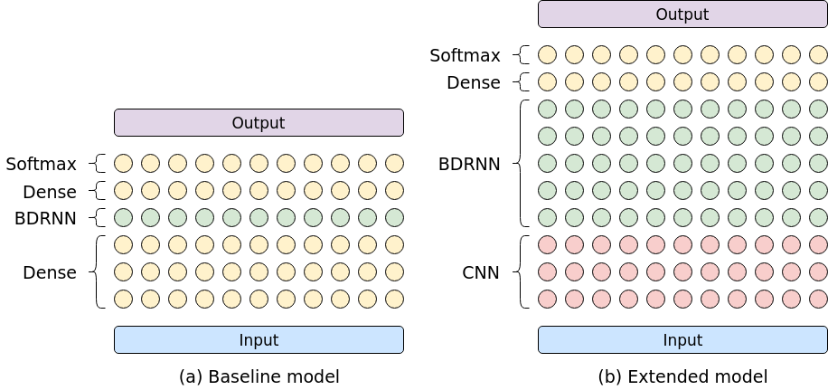

# End-to-End Speech Recognition System Using Connectionist Temporal Classification
Automatic speech recognition (ASR) system implementation that utilizes the 
[connectionist temporal classification (CTC)](http://citeseerx.ist.psu.edu/viewdoc/summary?doi=10.1.1.75.6306)
cost function.
It's inspired by Baidu's
[Deep Speech: Scaling up end-to-end speech recognition](https://arxiv.org/abs/1412.5567)
and
[Deep Speech 2: End-to-End Speech Recognition in English and Mandarin](https://arxiv.org/abs/1512.02595)
papers.
The system is trained on a combined corpus, containing 900+ hours.
It achieves a word error rate (WER) of 12.6% on the test dataset, without the use of an external
language model.



(a) shows the Deep Speech (1) model and (b) a version of the Deep Speech 2 model architecture. 


## Contents
* [Installation](#installation)
  * [Arch Linux](#arch-linux)
  * [Ubuntu](#ubuntu)
* [Configuration](#configuration)
* [Datasets](#datasets)
* [Training](#training)
* [Evaluation](#evaluation)
* [License](LICENSE)


## Installation
The system was tested on Arch Linux and Ubuntu 16.04, with Python version 3.5+ and the 1.12.0 
version of [TensorFlow](https://www.tensorflow.org/). It's highly recommended to use TensorFlow 
with GPU support for training.


### Arch Linux
```shell
# Install dependencies.
sudo pacman -S sox python-tensorflow-opt-cuda tensorbaord

# Install optional dependencies. LaTeX is only required to plot nice looking graphs.
sudo pacman -S texlive-most

# Clone reposetory and install Python depdendencies.
git clone https://github.com/mdangschat/ctc-asr.git
cd speech
# Setup optional virtual environment.
pip install -r requirements.txt
```

### Ubuntu
Be aware that the [requirements.txt](requirements.txt) lists `tensorflow` as dependency, if you
install TensorFlow through [pip](https://pypi.org/project/pip/) consider removing it as dependency
and install `tensorflow-gpu` instead.
Based on my experience it's worth the effort to 
[build TensorFlow from source](https://www.tensorflow.org/install/source).

```shell
# Install dependencies.
sudo apt install python3-tk sox libsox-fmt-all

# Install optional dependencies. LaTeX is only required to plot nice looking graphs.
sudo apt install texlive

# Clone reposetory and install Python depdendencies. Don't forget to use tensorflow-gpu.
git clone https://github.com/mdangschat/ctc-asr.git
cd speech
# Setup optional virtual environment.
pip3 install -r requirements.txt
```


## Configuration
The network architecture and training parameters can be configured by adding the appropriate flags
or by directly editing the [params.py](python/params.py) configuration file.


## Datasets
The following datasets were used for training and are listed in the `data` directory, however, the
individual datasets are not part of the repository and have to be acquired by each user.

* [Common Voice](https://voice.mozilla.org/en/new) (v1)
* [LibriSpeech ASR Corpus](http://www.openslr.org/12/)
* [Tatoeba](https://tatoeba.org/eng/)
* [TED-Lium](http://www.openslr.org/19/) (v2)
* [TIMIT](https://catalog.ldc.upenn.edu/LDC93S1)

The test dataset consists of all clean training subsets from those datasets.
Only the LibriSpeech clean dev set is used as the validation/development set and the LibriSpeech
and Common Voice clean test sets are used as testing dataset. 
The ASR system works on 16 kHz mono WAV files.

A helper that downloads the free corpora and prepares the data and creates the merged corpora can
be found in [python/dataset/generate_dataset.py](python/dataset/generate_dataset.py).
The file needs to be adjusted for the datasets that should be used, it further expects the TIMIT
dataset to be present. 
The following tree shows a possible folder structure for the data directory.

```
data/
├── cache
│   ├── cv_corpus_v1.tar.gz
│   ├── dev-clean.tar.gz
│   ├── .gitignore
│   ├── tatoeba_audio_eng.zip
│   ├── TEDLIUM_release2.tar.gz
│   ├── test-clean.tar.gz
│   ├── train-clean-100.tar.gz
│   └── train-clean-360.tar.gz
├── commonvoice_dev.txt
├── commonvoice_test.txt
├── commonvoice_train.txt
├── corpus
│   ├── cv_corpus_v1
│   ├── .gitignore
│   ├── LibriSpeech
│   ├── tatoeba_audio_eng
│   ├── TEDLIUM_release2
│   └── timit
├── corpus.json
├── dev.txt
├── .gitignore
├── librispeech_dev.txt
├── librispeech_test.txt
├── librispeech_train.txt
├── tatoeba_train.txt
├── tedlium_dev.txt
├── tedlium_test.txt
├── tedlium_train.txt
├── test.txt
├── timit_test.txt
├── timit_train.txt
└── train.txt
```


### `train.csv` 1050+ Hours
Examples shorter than 0.7 and longer than 17.0 seconds have been removed.
TEDLIUM examples with labels shorter than 5 words have been removed.
`train.csv` is sorted by feature sequence length in ascending order.

* `commonvoice_train.csv`
* `librispeech_train.csv`
* `tatoeba_train.csv`
* `tedlium_train.csv`
* `timit_train.csv`


### `dev.csv`
* `librispeech_dev.csv`


### `test.csv`
* `commonvoice_test.csv`
* `librispeech_test.csv`


### Statistics
```console
ipython python/dataset/word_counts.py 
Calculating statistics for /home/gpuinstall/workspace/ctc-asr/data/train.csv
Word based statistics:
        total_words = 10,069,671
        number_unique_words = 81,161
        mean_sentence_length = 14.52 words
        min_sentence_length = 1 words
        max_sentence_length = 84 words
        Most common words:  [('the', 551055), ('to', 306197), ('and', 272729), ('of', 243032), ('a', 223722), ('i', 192151), ('in', 149797), ('that', 146820), ('you', 144244), ('it', 118133)]
        27416 words occurred only 1 time; 37,422 words occurred only 2 times; 49,939 words occurred only 5 times; 58,248 words occurred only 10 times.

Character based statistics:
        total_characters = 52,004,043
        mean_label_length = 75.00 characters
        min_label_length = 2 characters
        max_label_length = 422 characters
        Most common characters: [(' ', 9376326), ('e', 5264177), ('t', 4205041), ('o', 3451023), ('a', 3358945), ('i', 2944773), ('n', 2858788), ('s', 2624239), ('h', 2598897), ('r', 2316473), ('d', 1791668), ('l', 1686896), ('u', 1234080), ('m', 1176076), ('w', 1052166), ('c', 999590), ('y', 974918), ('g', 888446), ('f', 851710), ('p', 710252), ('b', 646150), ('v', 421126), ('k', 387714), ('x', 62547), ('j', 61048), ('q', 34558), ('z', 26416)]
        Most common characters: [' ', 'e', 't', 'o', 'a', 'i', 'n', 's', 'h', 'r', 'd', 'l', 'u', 'm', 'w', 'c', 'y', 'g', 'f', 'p', 'b', 'v', 'k', 'x', 'j', 'q', 'z']
```


## Training
Start training by invoking `ipython python/train.py`.
Use `ipython python/train.py -- --delete` to start a clean run and remove the old checkpoints.
Please note that all commands are expected to be executed from the projects root folder.
The additional `--` before the actual flags begin is used to indicate the end of IPython flags.

The training progress can be monitored using Tensorboard.
To start Tensorboard use `tensorboard --logdir <checkpoint_directory>`.
By default it can then be viewed on [localhost:6006](http://localhost:6006).


## Evaluation
Evaluate the current model by invoking `ipython python/evaluate.py`.
Use `ipython python/evaluate.py -- --test` to run on the test dataset, instead of the development 
set.


<!--
# vim: ts=2:sw=2:et:
-->